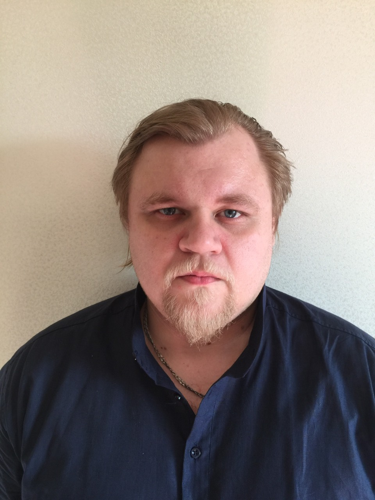

# Белов Эдуард Владимирович

## О себе.

Работаю Системным администратором, увлекаюсь водным туризмом и  аквариумистикой. Работаю системным администратором более 15 лет на аутсорсинге в организациях: ООО "Линия Дверей", ООО "Програмный родукт", ООО "Дар Инвест", ООО "Теплоконтроль".
Образование высшее, в 1989 году закончил Волгоградский инженерно-строительный институт по специальности "Промышленное и гражданское строительство", имею квалификацию "Инженер Строитель".

## Список навыков:
* Руководство IT-подразделением. 
* Установка и администрирование Серверов (как на базе Windows server 2003/2008/2012, так и любых UNIX(Linux, FreBSD) систем)
* Проектировка и монтаж ЛВС любой сложности.
* Установка-настройка (обслуживание) сетевого оборудования, различной сложности.
* Обеспечение информационной безопасности, расследование утечек информации.
* внедрение автоматизаций на производстве.
* Администрирование 1С
* Проектирование монтаж и настройка систем Видеонаблюдения.
* Презентация проектов, составление сметы. Продажа оборудования, услуг и программного обеспечения.

